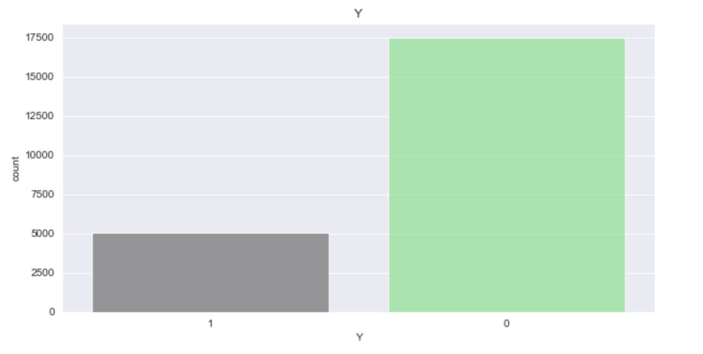
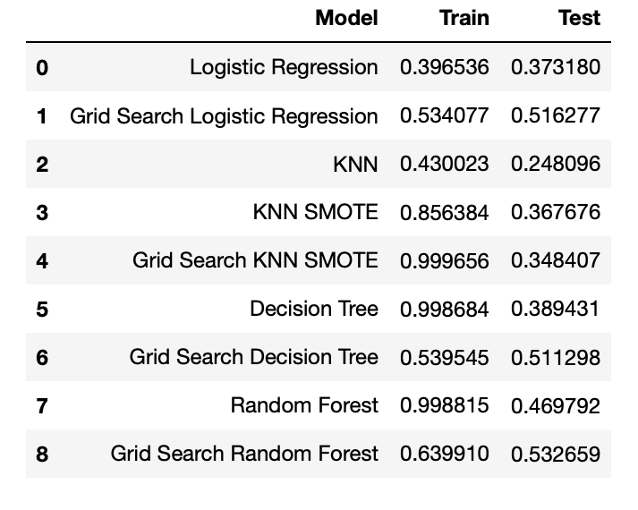

# Taiwanese_Default_Predictions
Author: Jaclyn Dwyer


## Overview
This project examins data obtained from customers' credit card default payments in Taiwan. The goal of this project is to create a model that can predict whether customers will default on their payments. The models will be evaluated using F1 score in order to take into account both false negatives and false positives.

## Method
The methodology for this project includes data cleaning, exploratory data analysis, and running various models to determine the model with the highest F1 score.

## Model
Various models are created across multiple classifcation techniques in order to try and generate a model with the highest F1 score. For each type of model, a preliminary model is created as well as a model built using Grid Search to find the best parameters. There is a class imbalance present between default and no default in the data. This will be taken into account by using a balanced class weight in the models.


## Model Evaluation
The model with the highest F1 score on the test set is the Grid Search Random Forest Model. While some other models had higher F1 scores on the train set, they had lower F1 scores on the test data, signifying overfitting.


## Final Model 
The Grid Search Random Forest model is the final model picked based off the results above. This model has F1 scores of about 0.64 on the train data and 0.53 on the test data. This model is deemed the best model since this model gives the highest F1 score on the test data.

## Next Steps
Further analysis could benefit from the following:
  - Engineering features in order to better predict if a customer with default
  - Adding more models such as a XGBoost model to try and generate a higher F1 score
  - Running model on more unseen data

# Repository Structure
```
├── data
├── images
├── Final_Notebook.ipynb
└── README.md
```
